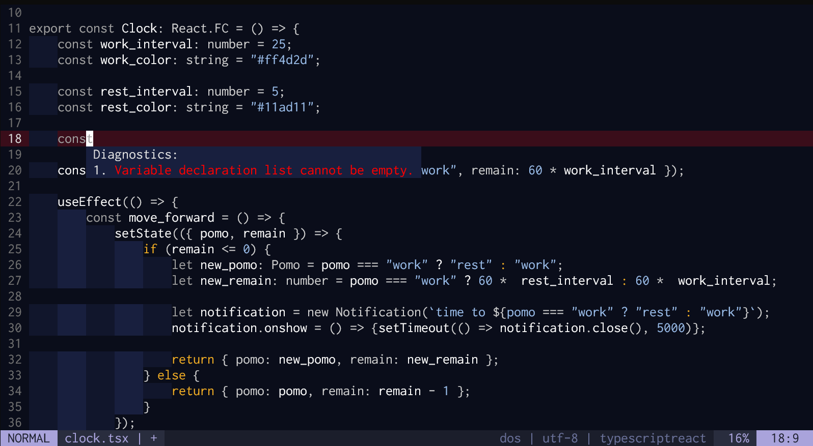

# monokuro.vim

A colorscheme puts emphasis on readability.
monokuro.vim emphasizes what you really need to see.

## Has been adapted to
- Neovim built in lsp client
- Treesitter
- Defx.vim

## Will be adapted to
- lightline.vim
